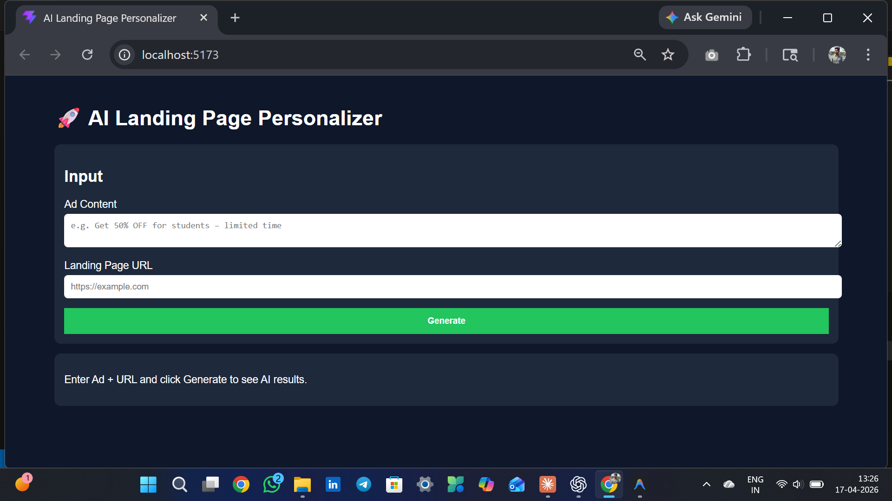

<div align="center">


<br/><br/>

# 🚀 AI Landing Page Personalizer

### 🧠 AI-Powered Conversion Rate Optimization System

<br/>

[](https://your-vercel-link.vercel.app)
[](https://your-render-link.onrender.com/docs)
[](https://github.com/your-username)

</div>

---

## 📸 Project Interface

(Screenshots/screenshot2.png)

---

## 📋 Table of Contents

- [About the Project](#-about-the-project)
- [Problem Statement](#-problem-statement)
- [Solution](#-solution)
- [How It Works](#-how-it-works)
- [Tech Stack](#-tech-stack)
- [Features](#-features)
- [Project Structure](#-project-structure)
- [Getting Started](#-getting-started)
- [Environment Variables](#-environment-variables)
- [Deployment](#-deployment)
- [Challenges](#-challenges)
- [Limitations](#-limitations)
- [Future Enhancements](#-future-enhancements)
- [Author](#-author)

---

## 🎯 About the Project

This project is an **AI-powered CRO (Conversion Rate Optimization) system** that analyzes advertisement content and dynamically enhances landing pages to improve user engagement and conversions.

It solves a real-world marketing problem — **message mismatch between ads and landing pages**.

---

## 🚨 Problem Statement

In digital marketing:

- Users click ads expecting specific offers  
- Landing pages often show generic content  
- This leads to:
  - ❌ High bounce rate  
  - ❌ Low engagement  
  - ❌ Poor conversion  

---

## 💡 Solution

This system automatically:

- Extracts ad intent (Offer, Audience, Tone)
- Scrapes landing page content
- Detects mismatches
- Generates AI-based improvements
- Renders a personalized landing page preview

---

## 🧠 How It Works
User Input (Ad + URL)
↓
Frontend (React)
↓
Backend (FastAPI)
↓
Web Scraping (Requests + BeautifulSoup)
↓
AI Processing (Gemini API)
↓
Optimized Output + Preview

---

## 🛠️ Tech Stack

| Layer | Technology |
|------|-----------|
| Frontend | React.js (Vite) |
| Backend | FastAPI (Python) |
| Scraping | Requests + BeautifulSoup |
| AI | Google Gemini API |
| Deployment | Vercel + Render |

---

## ✨ Features

- 🔍 Ad Content Analysis (Offer, Audience, Tone)
- 🌐 Landing Page Scraping
- ⚠️ Mismatch Detection
- 🤖 AI-Powered CRO Improvements
- 🔄 Before vs After Comparison
- 🧾 Enhanced Landing Page Preview
- 🛡️ Error Handling (403, 429, API failures)

---

## 📁 Project Structure
```bash
troopod-ai/
│
├── frontend/ # React Application
├── backend/ # FastAPI Server
├── README.md
└── requirements.txt
```

---

## 🚀 Getting Started

### 1. Clone the Repository

```bash
git clone https://github.com/your-username/ai-landing-page-personalizer.git
cd ai-landing-page-personalizer
```
### 2. Setup Backend
```bash
cd backend
python -m venv venv
venv\Scripts\activate   # Windows
pip install -r requirements.txt
uvicorn main:app --reload
```
### 3. Setup Frontend
```bash
cd frontend
npm install
npm run dev
```
### 🔑 Environment Variables

#### Create .env in backend:
```bash
GEMINI_API_KEY=your_api_key_here
```
### ☁️ Deployment
```bash
Service	Platform
Frontend	Vercel
Backend	Render
```

### ⚠️ Challenges
- ❌ Website scraping blocked (403 errors)
- ❌ Gemini API quota issues (429 errors)
- ❌ Model compatibility issues (404 errors)

### ⚠️ Limitations
- Cannot scrape protected websites (Amazon, Udemy)
- Depends on AI API quota
- Static scraping only (no JS rendering)

### 🚀 Future Enhancements
- Selenium-based dynamic scraping
- Multi-language support
- A/B testing engine
- AI scoring system

### 🧠 Key Learnings
- Difference between code issues vs infrastructure issues
- Handling API rate limits and quotas
- Real-world constraints in scraping
- Building end-to-end AI systems

### 👨‍💻 Author
<div align="center">
GATTU MANI KUMAR

</div>
<div align="center">

⭐ If you found this project useful, consider giving it a star!

</div> 
